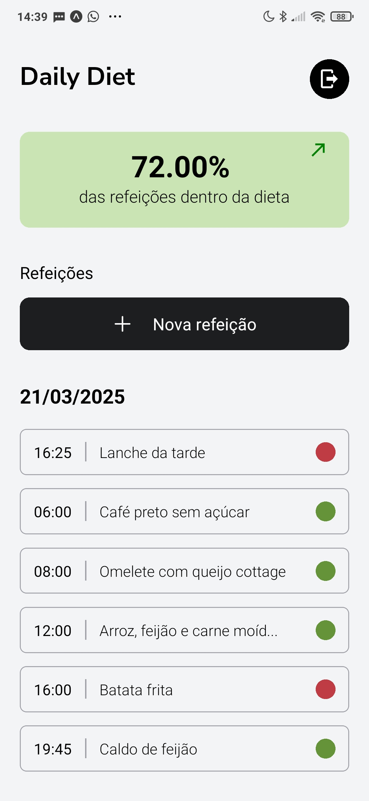
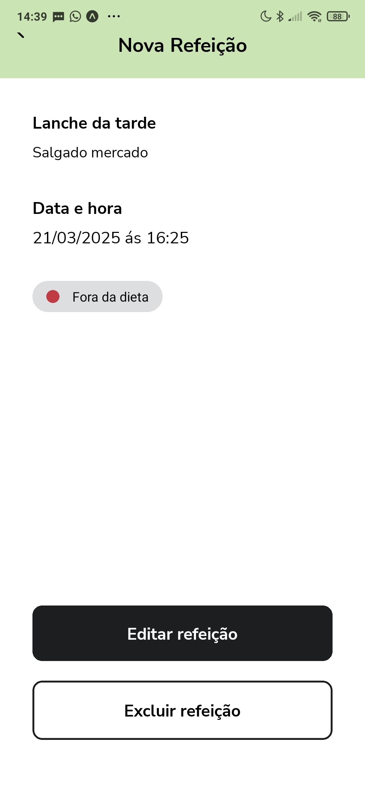
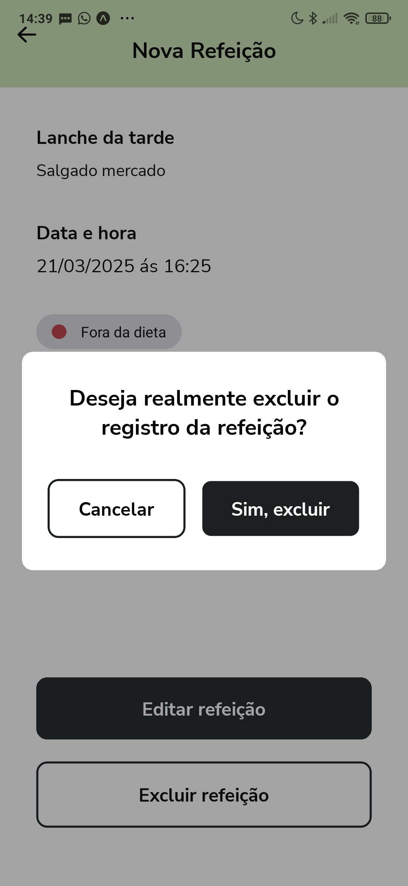
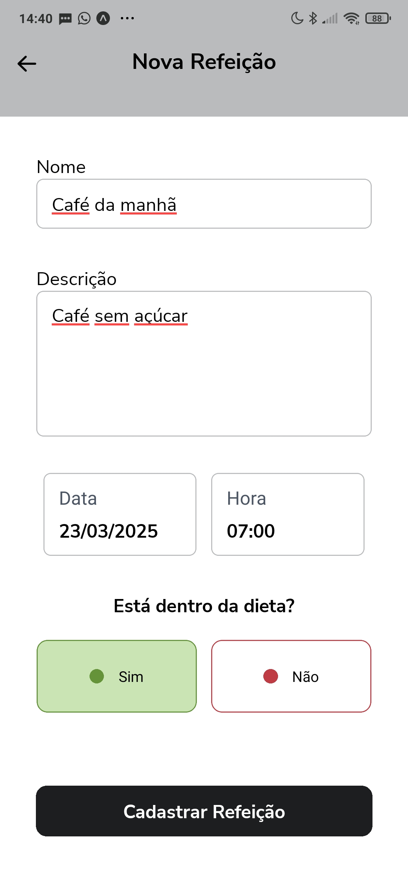
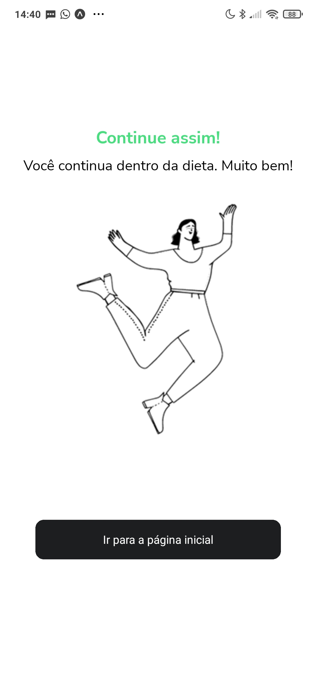
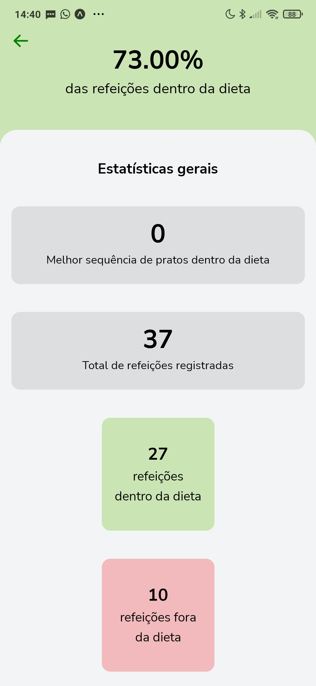
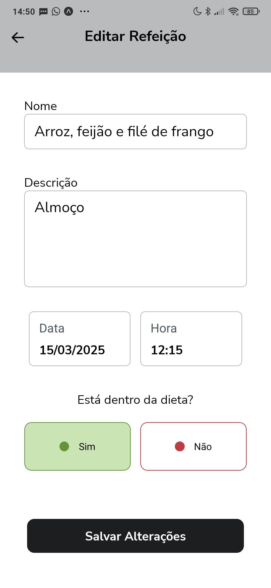
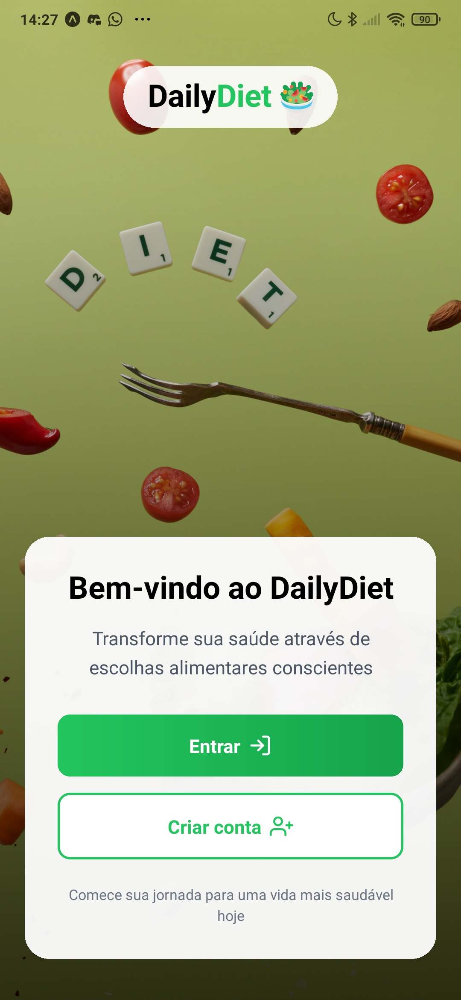
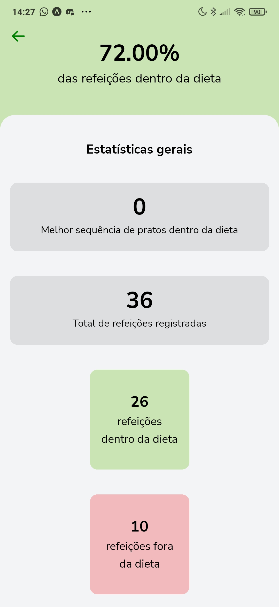

# 🥗 DailyDiet

DailyDiet é um aplicativo mobile para controle de dieta, permitindo registrar e acompanhar suas refeições diárias, mantendo um histórico do que está dentro ou fora da sua dieta.

## 📱 Screenshots

<div align="center">
  <div style="display: flex; gap: 0.5rem;">
    
    
    
  </div>
  
  <div style="display: flex; gap: 0.5rem; margin-top: 0.5rem;">
    
    
    
  </div>

  <div style="display: flex; gap: 0.5rem; margin-top: 0.5rem;">
    
    
    
  </div>
</div>

## ✨ Funcionalidades

- 👤 Autenticação:
  - Login de usuário
  - Registro de novo usuário
  - Persistência de login
- 📝 Registro de refeições com:
  - Nome
  - Descrição
  - Data e hora
  - Status (dentro/fora da dieta)
- 📊 Estatísticas detalhadas:
  - Porcentagem de refeições dentro da dieta
  - Sequência de refeições dentro da dieta
  - Total de refeições registradas
  - Contagem de refeições dentro/fora da dieta
- 📱 Interface intuitiva:
  - Agrupamento de refeições por data
  - Indicadores visuais de status (verde/vermelho)
  - Navegação simplificada
  - Feedback visual após ações

## 🚀 Tecnologias

### Frontend
- [Expo](https://expo.dev) - Framework para desenvolvimento mobile
- [React Native](https://reactnative.dev) - Framework para apps nativos
- [TypeScript](https://www.typescriptlang.org) - Superset JavaScript tipado
- [TailwindCSS](https://tailwindcss.com) - Framework CSS utilitário
- [Expo Router](https://docs.expo.dev/router/introduction) - Sistema de rotas
- [AsyncStorage](https://react-native-async-storage.github.io/async-storage/) - Persistência de dados local

### Backend
- [Fastify](https://www.fastify.io/) - Framework web rápido e eficiente
- [PostgreSQL](https://www.postgresql.org/) - Banco de dados relacional
- [Docker](https://www.docker.com/) - Containerização
- [Zod](https://zod.dev/) - Validação de schemas
- [CORS](https://developer.mozilla.org/pt-BR/docs/Web/HTTP/CORS) - Compartilhamento de recursos

## 💻 Começando

### Configurando o Backend

1. Navegue até a pasta da API:
   ```bash
   cd api
   ```

2. Inicie o container Docker com PostgreSQL:
   ```bash
   docker-compose up -d
   ```

3. Instale as dependências do backend:
   ```bash
   npm install
   ```

4. Inicie o servidor:
   ```bash
   npm run dev
   ```

### Configurando o Frontend

1. Na pasta frontend, instale as dependências:
   ```bash
   cd frontend
   npm install
   ```

2. Inicie o projeto:
   ```bash
   npx expo start
   ```

## 📱 Executando o App

Você pode executar o app de várias formas:

- **Expo Go**: Escaneie o QR code com o app Expo Go ([Android](https://play.google.com/store/apps/details?id=host.exp.exponent) / [iOS](https://apps.apple.com/app/expo-go/id982107779))
- **Emulador**: Use um [emulador Android](https://docs.expo.dev/workflow/android-studio-emulator) ou [simulador iOS](https://docs.expo.dev/workflow/ios-simulator)
- **Dispositivo físico**: Conecte seu dispositivo via USB

## 🎯 Recursos Principais

- **Gestão de Estado**: Hooks personalizados para gerenciamento de dados
- **Navegação**: Sistema de rotas baseado em arquivos com Expo Router
- **API**: Integração com backend para persistência de dados
- **UI/UX**: Interface moderna e responsiva com feedback visual
- **Tipagem**: TypeScript para maior segurança e manutenibilidade
- **Autenticação**: Sistema completo de login e registro
- **Persistência**: Dados do usuário mantidos entre sessões


